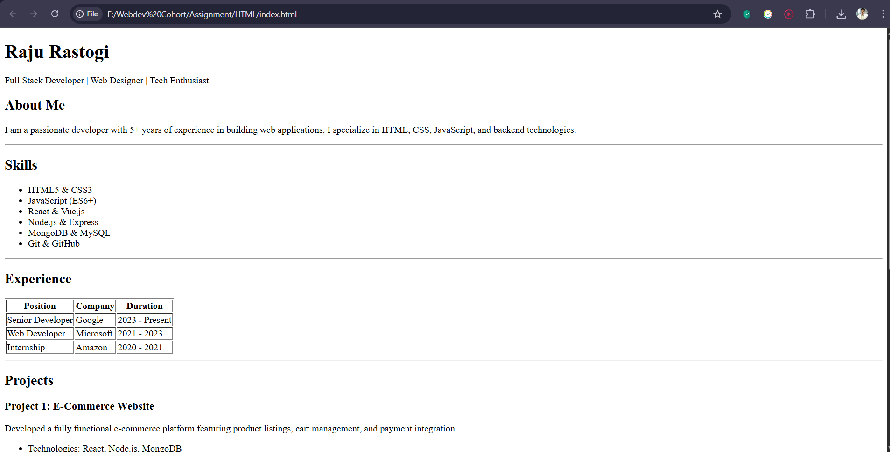
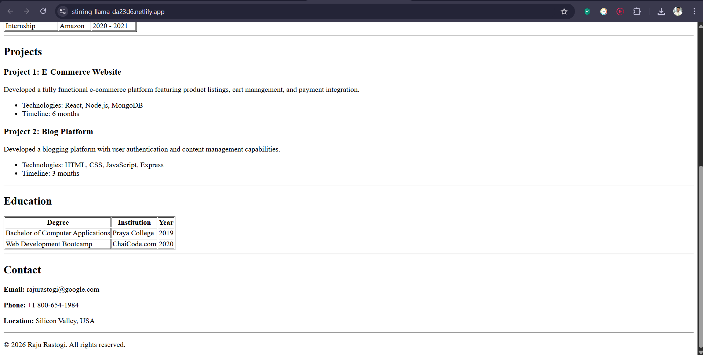

# HTML Resume Page

This project is a basic HTML resume webpage created as part of a learning assignment. It demonstrates the use of semantic HTML elements to structure a clean and professional resume layout.

## Project Overview

The resume includes the following sections:

- Header with name and professional title
- About Me
- Skills
- Experience
- Projects
- Education
- Contact Information
- Footer

## Technologies Used

- HTML5

## Live Demo

👉 https://stirring-llama-da23d6.netlify.app

## File Structure

/Resume
│
├── index.html
├── README.md
│
└── assets/
      ├── resume-preview.png
      └── resume-sections.png

## Features

- Semantic HTML tags (`header`, `main`, `section`, `footer`)
- Clean and structured layout
- Proper content organization using lists
- Responsive viewport setup
- Beginner-friendly code structure

## How to Run

1. Download or clone the project.
2. Open `index.html` in any web browser.

## Author

**Rahul Jaiswal**  

## Screenshots

### Full Page Preview

### Sections Preview

